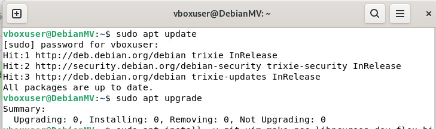
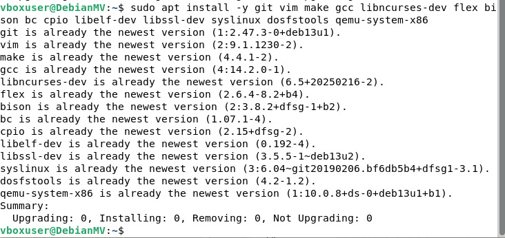
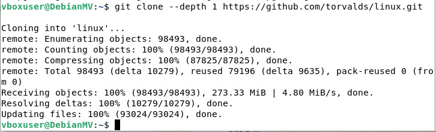
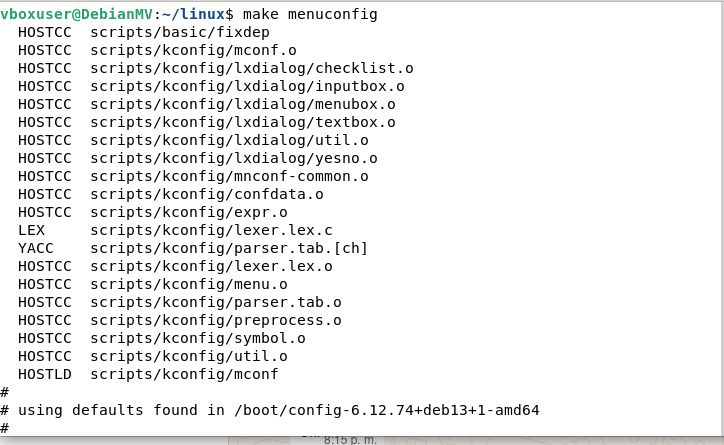
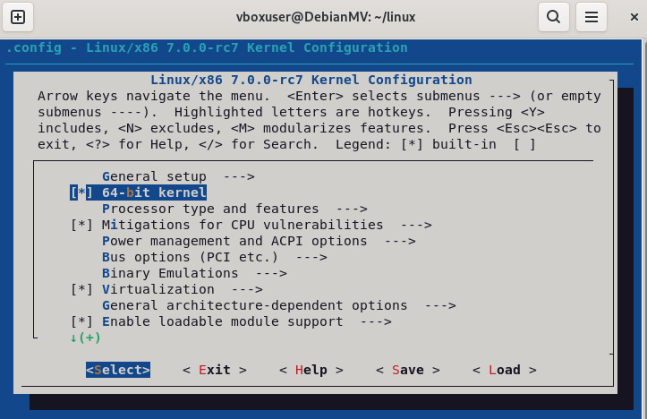
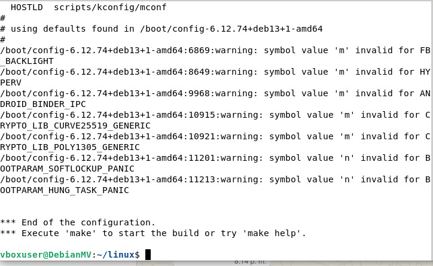
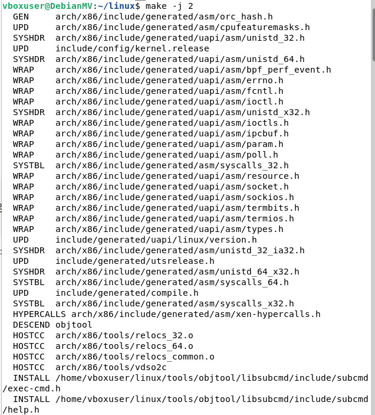

# UNIX-02-SIN-A-Mar-Jul-2026
Repo for intro to UNIX

1)Verify the firmware type: Run `[ -d /sys/firmware/efi ] && echo "UEFI" || echo "BIOS"` both in the Codespace and within QEMU. What result do you get and why?
In the Codespace, the command typically returns UEFI because modern environments use UEFI firmware and have the /sys/firmware/efi directory.
Within QEMU, the result is usually BIOS because QEMU boots with BIOS firmware (SeaBIOS) by default and doesn't create that directory. Therefore, the result is different; it depends on the type of firmware the system boots with.

2)Inspect the structure: Within QEMU, run `ls /` and compare it with the directory structure we saw in class. Which directories are missing and why?
Within QEMU (using BusyBox), when you run `ls /`, many typical directories like `/home`, `/usr`, `/var`, and sometimes `/tmp` are missing. This happens because it's a minimal system (initramfs), not a full Linux system. It only has what's necessary to boot, which is why the structure is much simpler.

3)Explore BusyBox: Within QEMU, run `ls -la /bin/` and observe that all commands are symbolic links to the same binary. What advantage does this have for an embedded system?
All commands in /bin/ are symbolic links to the same binary (BusyBox). The advantage is that it saves a lot of space, because a single program contains many commands. This is ideal for embedded systems where memory and storage are limited.

4)Examine blocks: In the Codespace, create a file with `echo "hello" > test.txt` and then run `stat test.txt`. Identify the actual size vs. the allocated blocks. Is there internal fragmentation? 
The file test.txt has a very small actual size (for example, a few bytes), but it occupies an entire block on disk (for example, 4 KB). Internal fragmentation does occur because the file system allocates fixed blocks even for small files, leaving unused space within the block.

5)Analyze partitions: Run `sudo parted -l && echo -e "\n---\n" && lsblk -f` on the Codespace. Identify which disks use GPT vs MBR, and which lesystems are in use.
Using `parted -l` you can see if the disk uses GPT or MBR (it will appear as “Partition Table: gpt” or “msdos”).
Using `lsblk -f` shows the file systems (ext4, vfat, etc.).
Many modern environments use GPT, but simpler or older configurations may use MBR. Common filesystems include ext4 (Linux) and vfat (boot or compatibility).